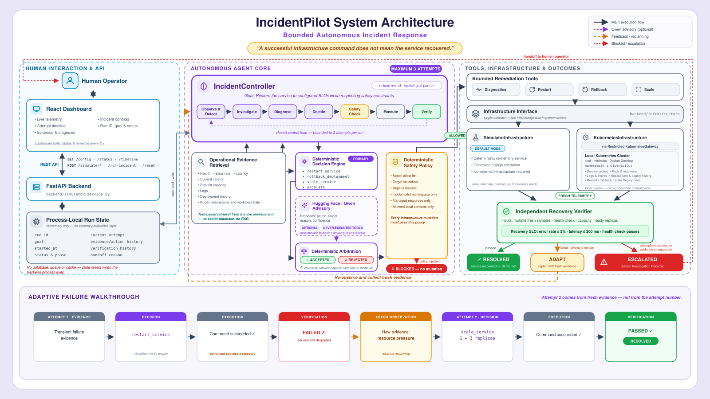

# IncidentPilot

IncidentPilot is a bounded autonomous incident-response agent for service
failures. It observes a live environment, detects an SLO breach, gathers
evidence, diagnoses the likely cause, proposes one restricted remediation,
passes it through a deterministic safety gate, executes it through an
infrastructure adapter, and verifies recovery from fresh telemetry.

The simulator is deterministic and needs no credentials or external
infrastructure. A restricted Kubernetes adapter provides the same workflow
against one allow-listed workload on a local cluster.

## Why it is agentic

IncidentPilot is a feedback loop, not a scripted action sequence:

```text
Observe → Detect → Investigate → Diagnose → Plan → Safety → Execute
   ↑                                                        ↓
   └──────────── Replan ← fresh evidence ← Verify ──────────┘
                                           │
                                      Resolved / Escalated
```

Each run has an explicit recovery goal, persistent in-memory state, a bounded
attempt budget, and a backend-generated audit timeline. A successful command
does not mean that the incident is resolved. Verification reads the
environment again, records named SLO/readiness checks, and classifies the
result as recovered, partial, or failed. A failed check updates run history
before the next diagnosis.

The adaptive demo proves this behavior end to end: restart is supported by
the initial evidence and executes successfully, but fresh telemetry still
fails. The new state exposes resource pressure, so the agent chooses scale on
its second attempt and verifies recovery. The controller does not inspect the
scenario name.

## Architecture



```text
React dashboard
      │  HTTP: health, config, status, timeline, commands
      ▼
FastAPI routes ── RuntimeManager (one active run, revisioned state)
                         │
                         ▼
                  IncidentController
             decision → policy → verification
                         │
                  Infrastructure interface
                    ┌────┴─────┐
                    ▼          ▼
             Simulator      Kubernetes
             environment    restricted gateway
```

FastAPI starts an incident asynchronously and returns HTTP 202 with its run
ID. A single background worker updates run state and immutable timeline
events after every meaningful transition. Scenario/reset mutations are
rejected while a run is active.

See [architecture details](docs/ARCHITECTURE.md), [setup](docs/SETUP.md), and
the [judge demo runbook](docs/DEMO.md).

## Safety boundary

Every proposed mutation is denied by default unless it satisfies all policy
rules:

- only `restart_service`, `rollback_deployment`, and `scale_service` are
  executable;
- namespace and resource targets must be allow-listed;
- replicas must remain from 1 through 3;
- automatic remediation stops after three attempts;
- Kubernetes writes are limited to restart, known-version rollback, and the
  Deployment scale subresource;
- there is no arbitrary shell, exec, apply, create, or delete tool.

Each decision records its rule ID, reason, target, bounds, and remaining
attempt budget. The dashboard's **Test Safety Gate** challenge proposes a
scale to 20 and proves that it is rejected without reaching infrastructure.

## Quick start

Prerequisites: Python 3.11 or 3.12 and Node.js 20+.

```powershell
py -3.12 -m venv .venv
.\.venv\Scripts\python.exe -m pip install -r requirements-dev.txt
Set-Location frontend
npm ci
Set-Location ..
```

Start the API from the repository root:

```powershell
$env:ENVIRONMENT='simulator'
$env:LLM_ENABLED='false'
.\.venv\Scripts\python.exe -m uvicorn backend.api.app:app --host 127.0.0.1 --port 8000
```

Start the dashboard in a second terminal:

```powershell
Set-Location frontend
npm run dev -- --host 127.0.0.1
```

Open [http://127.0.0.1:3000/dashboard](http://127.0.0.1:3000/dashboard).
Interactive API docs are at
[http://127.0.0.1:8000/docs](http://127.0.0.1:8000/docs).

macOS/Linux uses the same commands with `python3`,
`./.venv/bin/python`, and shell-style environment assignment. Full commands
are in [docs/SETUP.md](docs/SETUP.md).

## Demo

The shortest judge path is:

1. Click **Reset System** and show that a healthy run ends as `NO INCIDENT`
   with no remediation.
2. Select **Adaptive Incident**, then click **Run Incident**.
3. Show attempt 1: restart allowed and executed; verification fails on fresh
   telemetry.
4. Show the replan event and new resource-pressure evidence.
5. Show attempt 2: scale to three; verification passes; final status is
   `RESOLVED`.
6. Click **Test Safety Gate** and show scale-to-20 denied with
   `executed=false`.

Exact telemetry and expected events are in [docs/DEMO.md](docs/DEMO.md).

## API

| Method | Path | Purpose |
| --- | --- | --- |
| `GET` | `/health` | API liveness and selected environment status. |
| `GET` | `/service/health`, `/metrics`, `/version` | Read the selected target through its infrastructure adapter. |
| `GET` | `/config` | Public thresholds, bounds, mode, and capabilities; never secrets. |
| `GET` | `/status` | Current service observation and revisioned incident state. |
| `GET` | `/timeline` | Ordered backend-generated events for the current/latest run. |
| `POST` | `/run-incident` | Start one background run; returns HTTP 202 and a run ID. |
| `POST` | `/safety/evaluate` | Evaluate a policy challenge without executing it. |
| `POST` | `/simulate/outage` | Inject a transient simulator outage. |
| `POST` | `/simulate/bad-deployment` | Inject a v42 deployment regression. |
| `POST` | `/simulate/adaptive-incident` | Inject the deterministic replan scenario. |
| `POST` | `/simulate/capacity-incident` | Inject immediately visible capacity pressure. |
| `POST` | `/simulate/recover` | Restore simulator health. |
| `POST` | `/simulate/rollback?version=v41` | Apply a manual simulator rollback for diagnostics. |
| `POST` | `/reset` | Reset simulator/runtime state when no run is active. |

Simulator injection endpoints are disabled in Kubernetes mode. The dashboard
detects the mode and shows the external scenario command instead.

## Configuration and optional dependencies

All safe defaults are validated by `backend/config.py`. Copy `.env.example`
to `.env` only when overriding them. The API's `/config` response exposes the
effective non-secret values used by the UI.

Dependency groups are intentionally separate:

```text
requirements.txt             API + simulator runtime
requirements-dev.txt         tests and local development
requirements-llm.txt         optional Hugging Face/Qwen proposal engine
requirements-kubernetes.txt  optional Kubernetes adapter
```

The optional model may propose an action but cannot execute tools. Its output
is schema-validated, compared with deterministic evidence, and still passes
through the same policy gate. Deterministic mode is complete and is the
recommended demo path.

## Tests

```powershell
.\.venv\Scripts\python.exe -m pytest -q
Set-Location frontend
npm test
npm run build
```

Tests cover healthy/no-incident semantics, scenario mutation, detection,
safety approval and rejection, fresh verification, partial recovery,
evidence-driven replanning, retry exhaustion, structured errors, runtime
locking, timeline ordering, API contracts, and Kubernetes restrictions. CI
runs the backend suite plus frontend tests and production build.

## Docker

With Docker running:

```bash
docker compose up --build
```

Open [http://localhost:3000](http://localhost:3000). The production Nginx
container serves the single-page app and proxies `/api` to the backend. Both
services have health checks. Compose uses in-memory simulator mode and does
not mount the source tree or install dependencies on startup.

## Kubernetes

The Kubernetes adapter targets only the `incidentpilot` namespace, one
allow-listed Deployment and Service, and local kubeconfig contexts by
default. Setup and limitations are documented in
[docs/kubernetes.md](docs/kubernetes.md); repeatable failure workloads are in
[docs/kubernetes-scenarios.md](docs/kubernetes-scenarios.md).

## Limitations

- Runtime state is single-process, in memory, and intentionally not durable.
- Only one incident may run at a time.
- Kubernetes telemetry uses bounded application probes and Deployment state;
  there is no Prometheus integration.
- Kubernetes mode is a local-cluster demo, not a production control plane.
- Hosted-model availability and latency depend on the configured provider;
  the deterministic engine requires neither.
